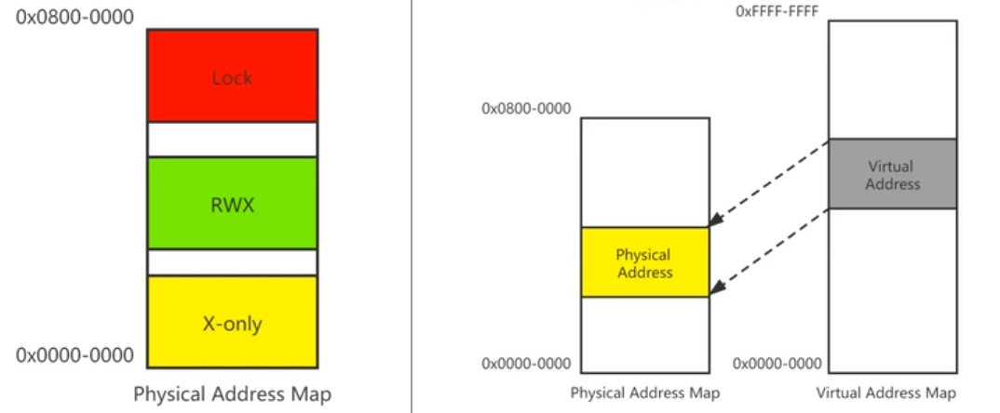
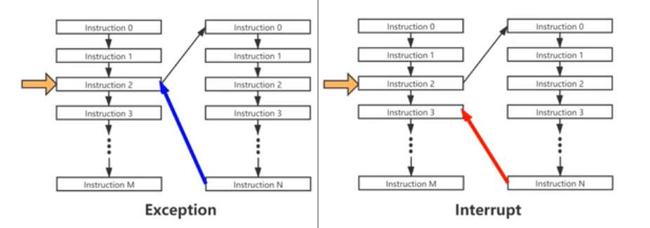

# RISC-V ISA介绍

> RISC-V通常是指RISC-V规范，也就是RISC-V ISA（指令集构架）。关于ISA存在很多不同的规范，除了RISC-V，主流的ISA还包括X86、ARM等，本节先对ISA做基本介绍，再具体介绍RISC-V ISA。

## 一、ISA 的基本介绍

### 1.ISA是什么

lSA (Instruction Set Architecture)即指令集架构，是底层硬件电路面向上层软件程序提供的一层接口规范。ISA在系统结构中的位置如下图所示：

ISA位于操作系统（Operating System）和微架构（Microarchiteture）之间，在ISA的下层是微架构，它是ISA的具体实现。对于同一套ISA，可以有不同的具体实现，比如同样是现实x86指令集系统，Intel和AMD采用了不同的微架构，不同的厂商在设计微架构时有不同的考虑（例如cpu单位面积上的功耗、速度、成本等），导致设计出的微架构各有不同。

在ISA的上层是操作系统。由于微架构可以有不同的实现方式，但如果这些微架构实现的是同一套ISA，那么操作系统通过这套ISA，便可以对不同的微架构进行控制。

具体来所，ISA的定义了如下的一些基本规范：

+ 基本数据类型及其长度：例如BYTE, HALFWORD, WORD等
+ 寄存器的类型和数量
+ 指令
+ 寻址模式
+ 异常和中断的处理方式
+ 等等......

有了统一的ISA后，微架构通过ISA的要求进行设计，而操作系统不再需要关心底层微架构的具体实现。

### 2.为什么要设计ISA

IBM（International Business Machines Corporation）在六七十年代首次提出指令集架构，在指令集架构未提出之前，IBM开发了不同用途的计算机，每种计算机的操作结构都不一样。在开发新的计算机时，需要有新的团队针对计算机的底层结构去开发特定的编译器和操作系统，带来了很大的开发成本。于是IBM公司从IBM360开始设计了第一套指令集架构，将ISA与其具体实现进行了分离，为上层软件提供一层抽象，制定规则和约束，让编程者不用操心具体的电路结构。

### 3.CISC vs RISC

指令集可分为CISC和RISC两类：

+ CISC复杂指令集(Complex Instruction Set Computing)是针对特定的功能实现特定的指令，导致指令数目比较多，但生成的程序长度相对较短。
+ RISC精简指令集(Reduced lnstruction Set Computing)只定义常用指令，对复杂功能采用常用的指令组合实现，这导致指令数目比较精简，但生成的程序长度相对较长。

早期计算机注重内存的利用，对于一个复杂的程序，由于内存的限制其指令条数不能太多，因而多采用CISC指令集。随着技术的发展，内存对程序的限制减轻了，同时人们更多的关注程序的可读性，促进了RISC的发展。现如今RISC和CISC也逐渐有相互融合的趋势。

### 4.ISA的宽度

ISA（处理器）的宽度指的是CPU中**通用寄存器**的宽度(二进制的位数)，这决定了寻址范围的大小、及数据运算的能力。常用的通用寄存器宽度如下表：

| 通用寄存器的宽度 | 寻址范围                    | 应用场景                                  |
| ---------------- | --------------------------- | ----------------------------------------- |
| 8位              | 2^8 = 256                   | 早期的单片机8051                          |
| 16位             | 2^16=65536                  | X86系列的鼻祖8086，MSP430系列单片机       |
| 32位             | 2^32=4294967296             | 早期的终端,个人计算机和服务器             |
| 64位             | 2^64 = 18446744073709551616 | 目前主流的移动智能终端,个人计算机和服务器 |

达到64位后计算机有很大的寻址范围，足够绝大部分场景的使用，因而128位的通用计算机并不常见。

需要注意的是：ISA的宽度和指令的编码长度无关。ISA的宽度是通用寄存器的宽度，而指令的编码则是指令的长度，两者的大小可以不同，例如32位的指令也可以放入64位的通用寄存器中。

## 二、RISC-V ISA 基本介绍

官方ISA标准可从https://riscv.org/technical/specifications中下载，整个指令集分为两卷，第一卷为非特权指令，第二卷为特权指令。

#### 2.1 RISC-V ISA的命名规范

ISA的命名格式为：$RV[\#\#\#][abc......xyz]$

这个命名格式包含三个部分：其中RV是用于表示RISC-V体系构建的前缀，即RISC-V的缩写；$[\#\#\#]$可取{32，64，128}，表示的是处理器的字宽，也就是处理器的寄存器的宽度（单位是bit）；$[abc...xyz]$表示该处理器支持的指令集模块的集合。

RISC-V芯片可根据需要进行定制，定制的芯片可支持特定的一组模块。例如RV32IMA表示的是：支持I模块、M模块、A模块的32位的RISC-V指令集；RV64GC则表示：支持G模块和C模块的64位的RISC-V指令集。

#### 2.2 模块化的ISA

传统的计算机体系结构采用增量的ISA，为了保证向后兼容性，同一个体系架构下的新一代处理器不仅实现了新的ISA扩展，还必须实现过去的所有扩展，目的是保持向后的二进制兼容性，典型的代表有80x86。

而RISC-V采用的是模块化的ISA，具体来说，模块化的ISA由一个基本整数指令集和多个可选的扩展指令集组成。其中基本整数（Integer）指令集是唯一强制要求实现的基础指令集， 它是固定的，其他指令集的都是可选的扩展模块。当要增加新的功能时，将增加到模块中，而基础指令集永远不会改变。

基本指令集及相关说明如下表：

| 基本指令集 | 描述                              |
| ---------- | --------------------------------- |
| RV32I      | 32位整数指令集                    |
| RV32E      | RV32I的子集，用于小型的嵌入式场景 |
| RV64I      | 64位整数指令集，兼容RV32I         |
| RV128I     | 128位整数指令集，兼容RV64I和RV32I |

其中模块I表示Integer，即基本整数指令集；E表示Embeded，即嵌入指令集。

扩展指令集及其相关说明如下表：

| 扩展指令集 | 描述                                                   |
| ---------- | ------------------------------------------------------ |
| M          | 整数乘法(Multiplication)与除法指令集                   |
| A          | 存储器原子(Automic)指令集                              |
| F          | 单精度(32bit)浮点(Float)指令集                         |
| D          | 双精度(64bit)浮点(Double)指令，兼容F                   |
| C          | 压缩(Compressed)指令集，其指令长度为标准指令长度的一半 |
| ……         | 其他标准化和为标准化的指令集                           |

RISC-V允许在实现中以可选的形式实现其他标准化和非标准化的指令集扩展。其中特定组合“IMAFD”被称为“通用(General)组合，用英文字母G表示，该组合能够支持整数运算、整数乘法运算、原子运算和浮点数运算。

需要注意的是，在RISC-V中浮点指令、乘法指令并非基本指令，而属于扩展指令。 

#### 2.3 通用寄存器（General Purpose Registers）

RISC-V的Unprivileged Specification定义了32个通用寄存器以及一个PC，这32个通用寄存器在RV321/RV64I/RV128I的CPU上都是一样的，如果实现支持F/D扩展则需要额外支持32个浮点(Float Point)寄存器。另外RV32E将32个通用寄存器缩减为16个。这32个通用寄存器的和PC的结构见下图：

RISC-V base unprivileged integer register state.

需要注意的是，在其他指令集架构中，PC寄存器对汇编程序员是可见的，即可以通过汇编指令对PC寄存器进行操作。但是RISC-V中PC寄存器对汇编程序员是不可见的。

寄存器的宽度由ISA指定，RV32的寄存器宽度为32位，RV64的寄存器宽度为64位，依次类推。每个寄存器具体编程时有特定的用途以及各自的别名。由RISC-V ApplicationBinary Interface (ABI)定义。

#### 2.4 Hart

HART即**Hardware Thread**，可翻译为硬件线程。早期的CPU的一个cu单元只有一条指令流，随着硬件的发展，出现了超线程技术，使得一个CPU可以有两个或多个指令执行流，例如Intel设计4核的CPU，但却有8个逻辑处理器。参考官方手册《The RISC-V Instruction Set Manual Volume I: Unprivileged ISA》1.2节，hart定义如下：

> From the perspective of software running in a given execution environment, a hart is a resource that autonomously fetches and executes RISC-V instructions within that execution environment. In this respect, a hart behaves like a hardware thread resource even if time-multiplexed onto real hardware by the execution environment. 
>
> 译：从在给定执行环境中运行的软件的角度来看，hart 是一种在该执行环境中自主获取和执行 RISC-V 指令的资源。 在这方面，即使执行环境将时间复用到真实硬件上，hart 的行为也类似于硬件线程资源。

RISC-V中将指令执行流抽象为hart的概念，一个hart可以理解为一个虚拟的CPU，每个hart为一个独立的执行单元。

#### 5.5 特权级别（Privileged Level）

RISC-V的Privileged Specification定义了三个特权级别(privilege level)。其中Machine级别是最高的级别，在RISC-V系统上电后，系统首先运行在Machine态，在该状态中程序访问的是物理地址而非虚拟地址。之后跳转到Supervisor态，类似进入保护模式，开始使用虚拟地址。User态即用户态。通过设置不同的状态可以实现分层的保护。

特权模式可以进行一定的组合，下表是RISC-V支持的组合：

| Number of levels | Supported Modes | Intended Usage                              |
| ---------------- | --------------- | ------------------------------------------- |
| 1                | M               | Simple embedded systems                     |
| 2                | M, U            | Secure embedded systems                     |
| 3                | M, S, U         | Systems running Unix-like operating systems |

其中Machine模式是所有的实现都需要支持的，对于一款通用的操作系统芯片，三种模式都是需要支持，只有开了MMU之后，支持虚拟地址之后，才能够实现进程的概念。

#### 2.6 Control and Status Registers（CSR）

为实现特权分级的保护，不同的特权级别下有各自的一套控制和状态寄存器(CSR)，同时RISC-V定义了专门用于操作CSR的指令（“Zicsr”扩展），用于控制(Control)和获取相应Level下的处理器工作状态。高级别的特权级别下可以访问低级别的CSR，譬如Machine Level下可以访问 Supervisor/User Level的CSR，以此类推；但反之不可以，当低级别的指令访问高级别的寄存器时，将出现异常。通过这样的方式，便实现了特权级别的保护。

在系统调用的过程中，低级别的指令不可避免的需要访问高级别寄存器，为实现这一功能，RISC-V定义了特定的指令（ECALL/EBREAK），便于在不同特权级别之间进行切换。当User态的指令需要访问Machine态的寄存器时，通过ECALL指令进入Machine态，在该模式下完成相应的指令功能，再通过EBREAK指令返回到User态。

#### 2.7 内存管理与保护

 RISC-V中有两类内存保护，一种是低级别的物理内存保护（Physical Memory Protection, PMP），如下图左侧示意图。这种保护方式将内存划分为特定的几个部分，在X-only部分的地址区域只存放指令，在RWX地址区域内的存放可读可写可执行的内容，在Lock地址区域存放进程通信的信号量。这种保护较为简单，基于物理地址完成。

另一种更高级的保护方式需要虚拟内存（Virtual Memory），如上图右侧所示，此时程序访问的地址是虚拟地址而非物理地址，通过MMU完成虚拟地址到物理地址的转换。

#### 2.8异常和中断 

异常由指令触发，如下图左侧示意图所示，当CPU执行某条指令出发异常时，将调用相关的异常处理程序，当异常处理程序结束后再回到触发异常的指令，接着继续执行。

而中断来自CPU外部，当CPU执行指令的过程中出现中断时，CPU也会暂停当前程序的执行，转而执行中断处理程序。与异常不同的是，中断结束后将执行被中断指令的下一条指令，如上图右侧示意图所示。

## 参考资料

【参考1】：The RISC-V Instruction Set Manual, Volume Ⅰ: Unprivileged ISA,Document Version 20191213

【参考2】：The RISC-V Instruction Set Manual, Volume Ⅱ: Privileged  Architecture, Document Version 20190608-Priv-MSU-Ratified

【参考3】：RISC-V手册(中文版): http://riscvbook.com/chinese/

