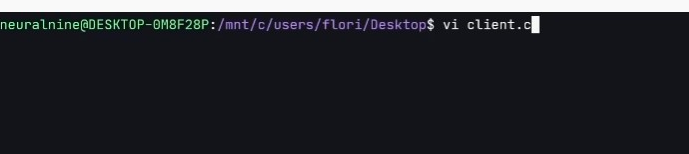
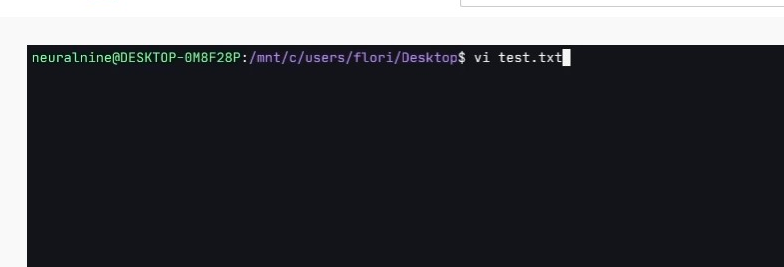
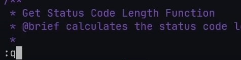

# 第二章 实训一  RISC-V下的VIM和GCC练习

## 任务1 熟悉VIM的基本操作

### 前言

VI 编辑器是Linux和Unix上最基本的文本编辑器，工作在字符模式下。由于不需要图形界面，使它成了效率很高的文本编辑器。尽管在Linux上也有很多图形界面的编辑器可用，但VI在系统和服务器管理中的功能是那些图形编辑器所无法比拟的。
VI有3个模式：插入模式、命令模式、低行模式。
插入模式：在此模式下可以输入字符，按ESC将回到命令模式。
命令模式：可以移动光标、删除字符等。
底行模式：可以保存文件、退出vi、设置vi、查找等功能(低行模式也可以看作是命令模式里的)。
VI有模式。通俗地做一下对比。notepad无模式（或称为只有一种编辑模式），你按下j，就是在正文中输入j；要保存，就要ctrl+s；要下移一行，就要↓或鼠标。而在VI中，打开一个文件后，并不处在编辑模式，而是Normal模式，此时你按j，VI并不认为你要在正文中输入j，而是代表光标下移一行。此时按i表示进入insert模式，即编辑模式，即notepad的模式。编辑模式按Esc退回normal模式。normal模式下按:进入命令行模式，用于输入较复杂的命令。比如:w代表保存文件，:e a.txt代表打开文件a.txt。即VI可以不用鼠标、方向键、菜单、Ctrl、alt……发出命令。
VI强大的编辑能力中很大部分是来自于其普通模式命令。vi的设计理念是命令的组合。

### 开始操作

在开始之前 

使用 Vim 编辑文件时，存在 3 种工作模式，分别是命令模式、输入模式和编辑模式，这 3 种工作模式可随意切换

首先我们使用vim打开一个文件

我们开始使用 Vim，我们的第一件事是打开一个文件。我们只需键入 vi 或 vim，然后是文件名，例如，clients.c 这是现有的文件。现在这种情况下 VIM 将打开文件进行编辑，我们可以改变一些东西，我们可以保存它，我们可以取消更改，等等。如果我们输入一些文件名或某些不存在的文件路径，将会发生的事情是我们要去创建一个新文件。

像 test.txt 这样的东西，这是可以创建一个新文件，这将打开一个空白文件，一旦我将更改写入文件，这个文件将由 Vim 创建。

所以现在让我们从clients.c开始，第一个是大多数人在进入VIM时都会遇到的问题我该如何退出它？所以我要马上告诉你，所有你需要的。

要做的是你需要输入冒号，Q，然后Enter。

让我们打开一个新文件text.txt 并敲入一些字符，会发现通过上面的方法无法退出。

同时提示您没有对修改的内容的去留做出回答

此处则需要使用 ：wq 命令来保存并关闭文件

下方是关于vim退出保存/不保存文件的表格

| 命令        | 功能描述                                           |
| ----------- | -------------------------------------------------- |
| :wq         | 保存并退出 Vim 编辑器                              |
| :wq!        | 保存并强制退出 Vim 编辑器                          |
| :q          | 不保存就退出 Vim 编辑器                            |
| :q!         | 不保存，且强制退出 Vim 编辑器                      |
| :w          | 保存但是不退出 Vim 编辑器                          |
| :w!         | 强制保存文本                                       |
| :w filename | 另存到 filename 文件                               |
| x！         | 保存文本，并退出 Vim 编辑器，更通用的一个 vim 命令 |
| ZZ          | 直接退出 Vim 编辑器                                |

任务：

1.使用vim创建一个名称为 class.txt 的文件。

2.在文件内键入 123456 保存并关闭文件。

3.重新打开class.txt 文件。

4.在第二行键入 123 不保存并退出vim编辑器。

5.重新打开文件，并将该文件另存为 class2.txt。

## 任务2 GCC的基本操作

### 开始操作

示例程序如下：

`
//test.c
#include <stdio.h>
int main(void)
{
    printf("Hello World!\n");
    return 0;
}

这个程序，一步到位的编译指令是:

gcc test.c -o test
`

实质上，上述编译过程是分为四个阶段进行的，即预处理(也称预编译，Preprocessing)、编译(Compilation)、汇编 (Assembly)和连接(Linking)。

1.预处理
`gcc -E test.c -o test.i 或 gcc -E test.c `

可以输出test.i文件中存放着test.c经预处理之后的代码。打开test.i文件，看一看，就明白了。后面那条指令，是直接在命令行窗口中输出预处理后的代码.

gcc的-E选项，可以让编译器在预处理后停止，并输出预处理结果。在本例中，预处理结果就是将stdio.h 文件中的内容插入到test.c中了。

2.编译为汇编代码(Compilation)
预处理之后，可直接对生成的test.i文件编译，生成汇编代码：

`gcc -S test.i -o test.s`
gcc的-S选项，表示在程序编译期间，在生成汇编代码后，停止，-o输出汇编代码文件。

3.汇编(Assembly)
对于上一小节中生成的汇编代码文件test.s，gas汇编器负责将其编译为目标文件，如下：

`gcc -c test.s -o test.o`

4.连接(Linking)
gcc连接器是gas提供的，负责将程序的目标文件与所需的所有附加的目标文件连接起来，最终生成可执行文件。附加的目标文件包括静态连接库和动态连接库。

对于上一小节中生成的test.o，将其与Ｃ标准输入输出库进行连接，最终生成程序test

`gcc test.o -o test`

任务： 独立完成上方操作内容