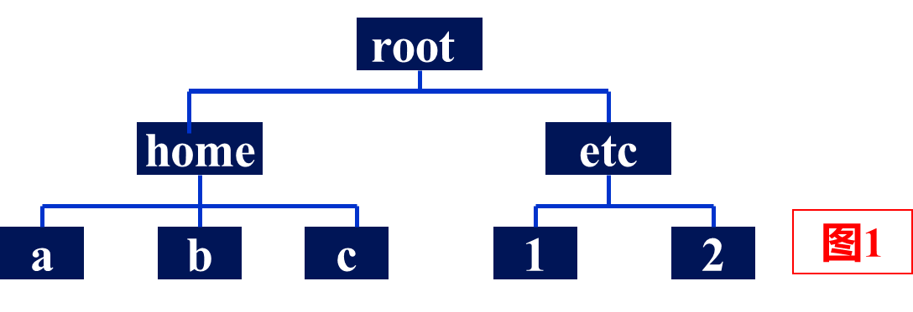

# RISC-V下的Shell编程基础

## 认识Linux Shell

在图形化桌面出现之前，和Unix系统交互的唯一方式就是通过Shell提供的文本命令行界面。 

今天的Linux环境已经完全不同，几乎所有的Linux发行版都采用了某种类型的图形化桌面环境，但是要访问Shell，仍然是需要一个文本显示来交互。 

我们是在Linux的终端下进入到Shell，大家看到这个是不是联想到WINDOWS下面的DOS，确实这个和当时WINDOWS的DOS也是有些类似。  

 Shell是个很有用的脚本工具，它多半运行在比编译型语言还高的层次，它能够轻易处理文件与目录之类的对象。   

Shell脚本最常用于系统管理工作，它可以把很多命令串在一起，放进一个独立的程序或者脚本中，这样只要执行这个脚本或者程序，便能完成工作。   

比如网站管理员，需要些Shell脚本，需要把脚本定期的发送到另外一个站点，备份数据库等，所以对于系统管理员来讲，学习Shell是非常有用的。   

### Shell的种类

/bin/sh (已经被/bin/bash 所取代)

/bin/bash (Linux 预设 shell)

/bin/ksh (Kornshell 由 AT&T Bell lab.开发，兼容 bash)

/bin/tcsh (整合 C Shell ，提供更多的功能)

/bin/csh (已经被/bin/tcsh 所取代)

/bin/zsh (基于ksh 开发，功能更强的 shell)

### 如何看自己目前的shell？

echo $SHELL（查看当前运行的Shell）

cat /etc/shells（查看系统支持的****Shell****）

/etc/shells 文件登记了本系统上合法的shell解释器

### 特点

**简单性**

Shell作为一个高级脚本语言，可以简洁地表达复杂的操作

**可移植性**

基于POSIX(Portable Operating System Interface)标准所定义的功能开发，脚本无需修改就可以在不同的Linux发行版上运行

**开发相对容易**

可以在短时间内开发出功能强大的脚本工具

## Linux Shell基本知识

### 目录结构

Linux目录结构 

/ 					 根目录，一般根目录下只存放目录,不存放文件
/home		   系统默认的用户宿主目录
/usr/bin		 该目录为命令文件目录，也称为二进制目录
/usr/sbin	   放置系统管理员使用的可执行命令
/etc		        系统配置文件的所在地，服务器的配置文件也在这里；
/var		        经常变动的目录，/var下有/var/log 是用来存放日志
/tmp		      临时文件目录，有时用户运行程序的时产生临时文件
/dev		       设备文件存储目录，比如声卡、磁盘... ...

绝对路径：

一定由根目录  / 写起
写shell最好用绝对路径
查可用命令的绝对路径：which [command]
查任意文件的绝对路径：realpath [filename]

相对路径：

不是由 / 写起，指相对于当前工作目录的路径
.     #当前目录
..    #上一层目录
~    #home目录          

### 命令

**单一指令**

ls

ps –aux

netstat –an

**连续指令**

mkdir /backup;cp /.* /backup/;logoutls

**条件指令**

逻辑与(&&)

   grep google sampleCom.txt && more sampleCom.txt

逻辑或(||)

  cc prog.c|| echo ‘compile error’

**内建命令**

是由shell本身所执行的命令

解析内建命令shell不需要创建子进程

比如：exit，history，cd，echo等

**外部命令**

在bash之外额外安装的，通常放在/bin，/usr/bin，/sbin，/usr/sbin......等等，比如：ls、vi等。

存在于文件系统中某个目录下的单独的程序

**如何辨别内建命令和外部命令？**

使用type可以查看是否是内建命令

**输入/输出**

**<** ： 输入重定向

**>** ： 输出重定向

**>>** ：将命令执行结果追加到指定的文件中

举例：

 **#** **ls** **./ > result.txt**  

 #资料夹中的子资料夹存到result.txt中

 **# echo “appending text”>> result.txt**       

 #追加appending text到result.txt中

